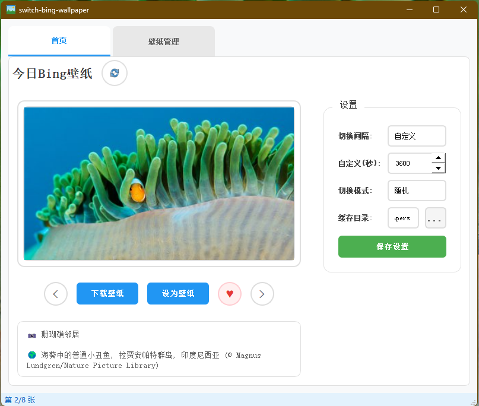
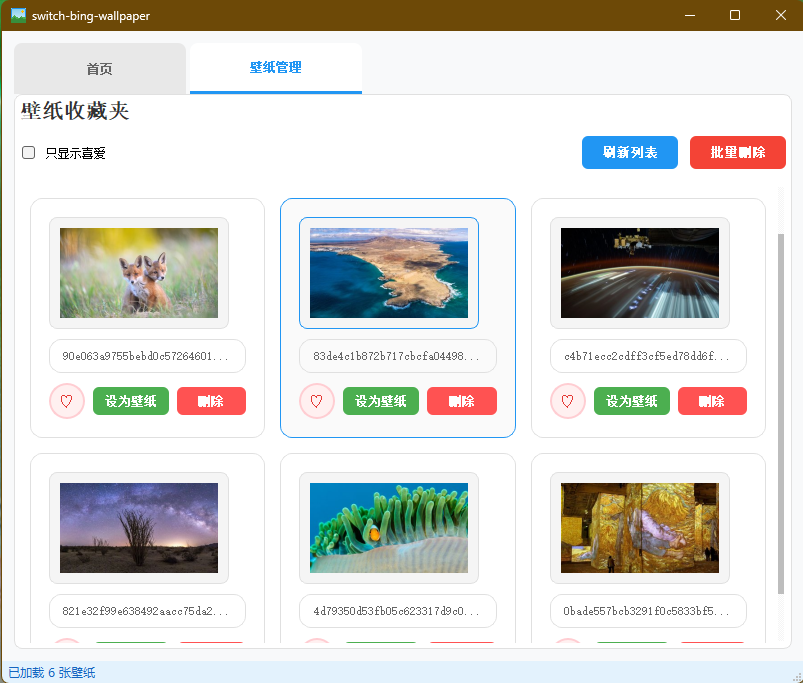

# Bing壁纸切换软件

## 功能介绍

本软件是基于Bing壁纸API开发的Windows平台壁纸切换工具，具有以下功能：

- **自动获取Bing每日壁纸**：每天自动从Bing API获取最新壁纸
- **壁纸自动切换**：支持设置自动切换间隔，定时更换壁纸
- **壁纸管理**：浏览壁纸列表，标记喜欢，删除壁纸
- **多种切换模式**：支持随机、喜爱、顺序三种切换模式
- **自定义设置**：可自定义自动切换时间、缓存目录等参数
- **系统托盘**：最小化到系统托盘，支持快速操作
- **低资源占用**：采用缓存机制，减少网络请求

## 界面预览

### 首页


### 壁纸管理


## 安装说明

### 方法一：使用已打包的exe文件

1. 下载发布的`switch-bing-wallpaper.exe`文件
2. 双击运行即可，无需安装

### 方法二：从源码运行

1. 确保系统已安装Python 3.8或更高版本
2. 克隆或下载项目代码
3. 安装依赖项：
   ```bash
   pip install -r requirements.txt
   ```
4. 运行应用程序：
   ```bash
   python main.py
   ```

## 使用方法

### 基本操作

1. **刷新壁纸**：点击"刷新壁纸"按钮获取最新的Bing壁纸
2. **设为壁纸**：选择壁纸后点击"设为壁纸"按钮设置当前壁纸
3. **标记喜欢**：点击"标记喜欢"按钮将壁纸添加到喜欢列表
4. **删除壁纸**：点击"删除"按钮删除选中的壁纸

### 配置设置

1. 点击菜单栏的"文件" -> "配置"打开配置对话框
2. **自动切换设置**：
   - 选择预设的切换间隔（15分钟、30分钟、60分钟）
   - 或选择"自定义"并输入自定义间隔（秒）
3. **切换模式**：
   - 随机：随机选择壁纸
   - 喜爱：只从喜欢的壁纸中选择
   - 顺序：按顺序选择壁纸
4. **缓存目录**：点击"浏览"按钮选择壁纸缓存目录
5. 点击"确定"保存配置

### 系统托盘操作

- 右键点击系统托盘图标，可进行以下操作：
  - 显示窗口：打开主界面
  - 下一张壁纸：立即切换到下一张壁纸
  - 退出：退出应用程序

## 技术说明

- **开发语言**：Python 3.14
- **GUI框架**：PyQt5
- **网络请求**：requests
- **系统调用**：ctypes（Windows）
- **打包工具**：PyInstaller

## 打包方法

如果需要自己打包应用程序：

1. 确保已安装所有依赖项
2. 运行打包命令：
   ```bash
   pyinstaller pyinstaller.spec
   ```
3. 打包后的文件将生成在`dist`目录中

## 注意事项

- 首次运行时，软件会自动创建缓存目录和配置文件
- 网络连接正常时，软件会自动从Bing API获取最新壁纸
- 网络连接异常时，软件会使用缓存的壁纸
- 喜欢的壁纸会保存在配置文件中，不会被自动删除

## 常见问题

### 1. 无法获取壁纸
- 检查网络连接是否正常
- 检查防火墙是否阻止了网络请求

### 2. 壁纸切换不生效
- 确保Windows系统权限正常
- 检查壁纸文件是否成功下载

### 3. 软件启动缓慢
- 首次启动时需要下载壁纸，可能会稍慢
- 后续启动会使用缓存，速度会加快

## 版本历史

- **v1.0.0**：初始版本
  - 实现Bing壁纸API调用
  - 支持壁纸自动切换
  - 支持壁纸管理功能
  - 支持系统托盘操作

- **v1.1.0**：功能扩展
  - 添加配置界面
  - 支持多种切换模式
  - 支持自定义切换间隔
  - 支持自定义缓存目录
  - 增加打包功能
